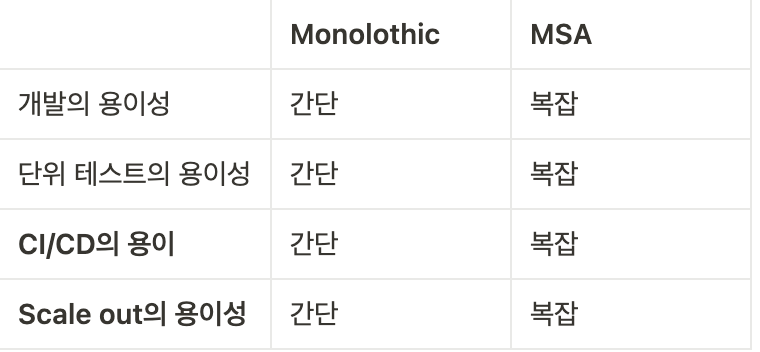
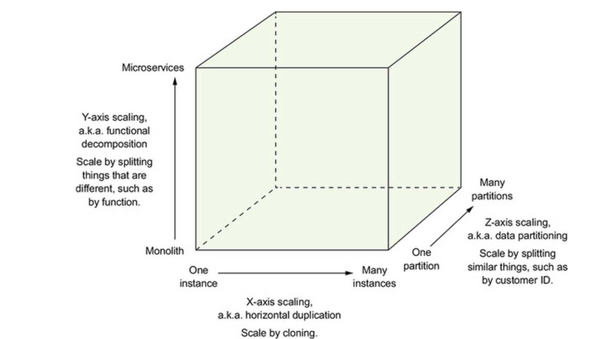
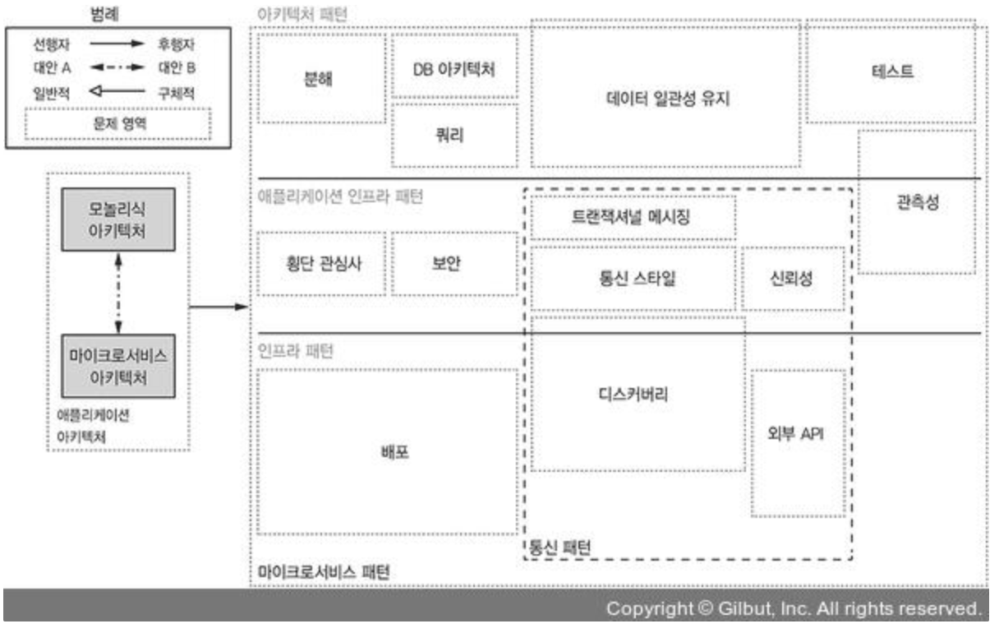
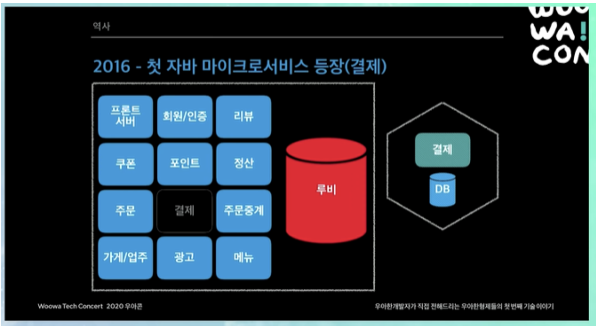
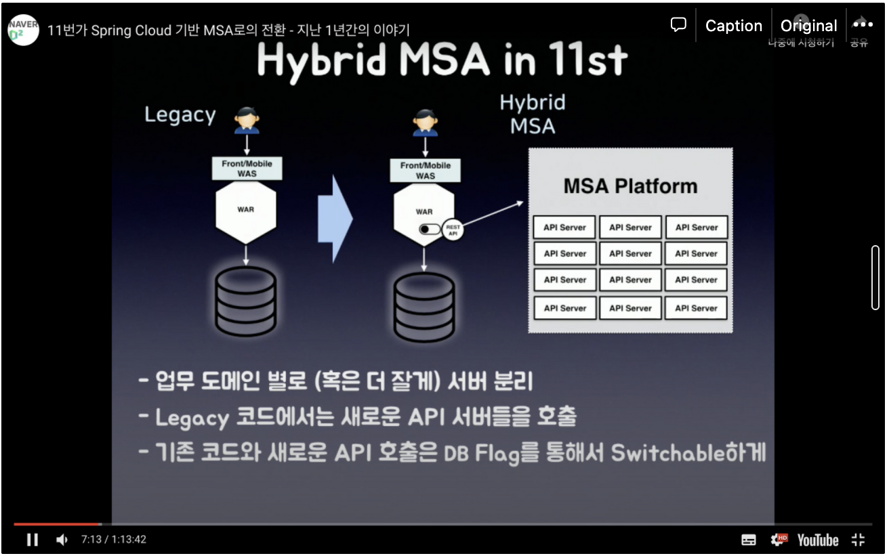
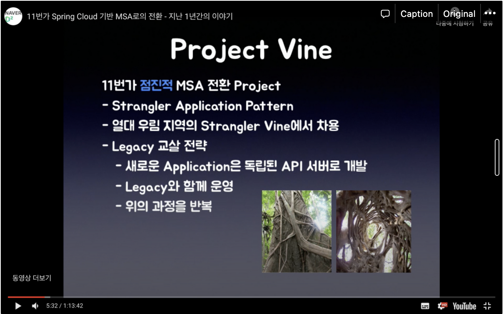

### **1.1 - 서서히 모놀리식 지옥에 빠져들다**

기존 legacy(FTGO) 아키텍쳐가 비대해지면서 생기는 문제 (ex. 배포 및 dependency 관리의 어려움, ...)가 발생하여 이를 해결하기 위한 방법으로 MSA로의 전환을 선택.

일반적으로 위 표와 같이 인식되고 있으나, 꼭 그렇지만은 않다고 생각(관점에 따라서 매우 다를 수 있음)

### **1.2 - 이 책의 대상 독자**

Monolothic architecture에서 msa로 전환을 생각하는 사람들이 주요 target이며 아래 지식을 가지고 있어야 함

- 3 layer architecture
- web application 설계
- OOP 기반의 Business logic 개발
- RDBMS 지식 - SQL, ACID
- Message broker, REST api를 이용한 IPC
- Authorization / Authentification

### **1.3 - 이 책의 학습 내용**

- MSA의 특성과 사용 시점
- Distributed data 관리 pattern
- MSA test 전략
- MSA 배포 전략
- legacy → MSA로의 리팩토링 전략

### **1.4 - 마이크로서비스 아키텍처가 답이다**

MSA의 정의란? → bounded context가 있는 느슨하게 결합된 element로 구성된 SOA (by. netflix)

SOA와 MSA의 차이를 IPC protocol / ESB의 사용 유무 / 서비스 별 독립 DB 존재 여부로 구분

이 책의 저자는 3차원 확장 모델에 영감을 받음

X-axis → instance의 수평 복제 (동일 서비스에 대한 부하 분산)

Y-axis → 기능 분해 (결제, 주문 등 도메인 별로)

Z-aixs → data 분해 (db 접근 시, uid같은 걸 이용해서 request를 분배)

### **1.5 - 마이크로서비스 아키텍처의 장단점**

MSA의 장점

- CI/CD에 용이
- 유지보수성이 뛰어남
- scale out이 유리
- 장애 대응이 유리
- 기술 선택의 자유로움

MSA 배포의 핵심

- 테스트성 : 자동화 테스트를 기반으로 함
- 배포성: 독립적으로 배포 가능
- 자율성, 느슨한 결합: 다른 팀과 독립적으로 개발, 배포, 확장이 가능하므로 유리

MSA의 단점

- 분산 환경에서의 장애 대응이 힘듦(ex. 여러 서비스가 얽혀있는 분산 transaction)
- 배포 시 여러 서비스에 걸친 기능이 있으면 주의가 필요
- 도입 시점을 언제로 잡아야 하나
- 딱 맞는 서비스를 찾기 힘듦(잘못 분해하면 MSA의 단점만 존재하는 분리된 distributed monolith)
- 운영의 복잡함(API gateway나 k8s, docker 등 다양한 기술에 대한 지식이 필요)

### **1.6 - 마이크로서비스 아키텍처 패턴 언어**

패턴 언어가 필요한 이유

- 다양한 architecture와 설계 옵션을 기술하고 더 나은 결정을 내리기 위해서
- 자신이 적용되는 맥락을 반드시 기술해야 한다는 점
- 중요하지만 간과되는 솔루션의 측면도 함께 기술한다는 점
- 위와 같은 이유로 인해서 MSA를 적용하는게 옳은 일인지 결정할 때 요긴

패턴 언어의 구조

- 강제 조항(forces)

  주어진 맥락에서 문제를 해결하고자 할 때, 반드시 처리해야 할 강제 조항(ex. 해당 서비스에서는 데이터의 정합성(exactly once) 보다는 처리 속도가 더 중요하다)

- 결과 맥락(resulting context)

  패턴을 적용한 결과를 다음 세 부분으로 기술

  - 장점
  - 단점
  - 이슈
- 연관 패턴(related patterns)

  한 패턴과 다른 패턴의 관계를 기술하는 영역

  - 선행자(predecessor): 이 패턴을 필요하게 만든 선행 패턴(ex. MSA 패턴의 경우 saga등 다양한 패턴에 대한 선행자)
  - 후행자(successor): 이 패턴으로 인해 생긴 이슈를 해결하는 패턴 (ex. Service discovery, circuit breaker)
  - 대안(alternative): 이 패턴을 대체할 수 있는 패턴 (ex. msa vs monolith)
  - 일반화(generalization): 문제를 해결하는 일반적인 솔루션
  - 세분화(specialization): 특정 패턴을 더 세부적으로 나타내는 형태
- 패턴은 다시 세 계층으로 분리
  - 인프라 패턴(infrastructure pattern): 개발 영역 밖의 인프라 문제 (ex. deploy, external api)
  - 애플리케이션 인프라(application infrastructure): 개발에도 영향을 미치는 인프라 문제 (ex. 인증/인가, transactional messaging, ipc protocol)
  - 애플리케이션 패턴(application pattern): 개발자가 맞닥뜨리는 문제(ex. query, test, db architecture)
  
  패턴은 아래와 같이 또 해결하려는 문제의 종류별로도 묶을 수 있다.
    - 애플리케이션을 분해하는 패턴
      - DDD 기반
      - 비즈니스 능력에 따라 서비스를 구성하는 방법
    - 통신 패턴
      - 어떤 IPC 사용하나?
      - discovery
      - 신뢰성
      - transactional messaging
      - external api
    - transaction 관리를 위한 데이터 일관성 패턴
      - 2 chase commit pattern
        상대적으로 saga pattern에 비해서는 구축하기 쉬움, 요즘 잘 안 쓰이는 방법, distributed transaction이 가능한 DB에서만 사용이 가능하고, 결국 transaction이 걸린 저장소에 대한 lock이 걸리는 방식
      - saga pattern (Choreography-Based**,** Orchestration-Based)
        서비스 내에서 처리하는 것, 별도의 Saga manager를 가지는 것으로 구분 가능
    - 데이터 쿼리 패턴
      - API 조합 패턴 : 서비스에서 여러 서비스를 호출하고 결과를 조합
      - CQRS: data replica를 유지해서 query
    - 서비스 배포 패턴
      - platform을 이용하는게 일반적 (k8s, docker등 여러 고려할 게 많으니까)
    - 관측성 패턴 (모니터링)
      - health check API (ex. actuator) : service health를 반환하는 api를 expose
      - 로그 수집(log aggregation): 서비스 내역을 기록하고 중앙 logging serer에 log를 출력
      - 분산 추적(distributed tracing): 각 external call마다 id를 부여해서 service를 돌아다니는 과정을 추적
      - 예외 추적(exception tracking): 에외 발생 시 추적 서비스에 보고
      - application metrics: service resources를 실시간으로 체크
      - 감사 로깅(audit logging): 사용자의 행동을 기록
    - 서비스 테스트 자동화 패턴
      - 타 서비스와의 작동이 제대로 되는지에 대해서 테스트 하는게 중요
      - end-to-end test의 경우 지양
      - 컨슈머 주도 계약 테스트(consumer-driven contract test): client가 의도한 대로 서비스가 동작하는지 확인
      - 컨슈머 쪽 계약 테스트(consumer-side contract test): client와 service가 상호 통신 가능한지 확인
      - 서비스 컴포넌트 테스트(service component test): service를 따로따로 테스트
    - 횡단 관심사 처리 패턴
      - cross cutting concern(ex. 인증/인가) 같은걸 모든 서비스에서 각자 처리하는건 비효율적이므로 이러한 이슈를 해결하는 곳에서 microservice chassis 패턴을 적용해서 서비스 구축
    - 보안 패턴
      - API gateway에서 일반적으로 jwt등을 활용해서 authentification/authorization을 처리하는게 맞음

### **1.7 - 마이크로서비스 너머 : 프로세스와 조직**

Service Architecture도 중요하지만, 올바른 개발/배포 프로세스가 수립되어야 성공적으로 개발이 가능

적당한 규모(8~12인)이 한 팀이 되는게 좋고, cross-functional한 service를 개발하는 별도의 팀을 구성하면 개발, 배포, 테스트하는데 유리

개발 수준은 아래 지표로 판단한다고 함

- 배포 빈도
- 리드 타임(lead time): 개발자가 변경분을 체크인해서 production까지 배포하는데 걸린 시간
- 평균 복구 시간(MTTR): production 문제 해결에 걸린 시간
- 변경분 실패율: production에 문제를 일으킨 변경분의 비율

### **Questions**

- msa ≠ silver bullet, MVP 모델을 이용해서 일단 개발하고나서 서비스가 어느정도 고도화 되면 그 때 전환 (ex. 11번가, 배민) 그래도 어느정도 서비스를 분리할 때를 감안해서 DB 설계가 필요함, 그런데 여기서 분할을 결정해야 할 시점은 언제일까?
  - 공통적으로 System 장애 대응이 어려워질 때(폭증하는 traffic을 감당하기 어려워 질 때)
- 기존 business는 계속되어야 할텐데, MSA로 전환은 어디서부터 시작할건지?
  - 배민 (핵심 서비스부터)
    
  - 11번가 (Hybird, 기존 시스템 운영하면서 신규 msa를 rest api로)
    
    
- z축 분할이 이론적으로는 괜찮아 보이는데 이게 맞을까?
  - 잘 맞는 도메인도 있긴 할텐데 아닌 경우도 분명히 존재 (부하 분산의 목적이라고 하지만, 실제로 책의 예제처럼 실제 request는 이상적으로 딱 나눠지진 않음)
- 실제로 저 패턴 언어를 사용할까...? reference를 찾기가 힘들었는데

**References**

- 배민 MSA 전환기 ([https://www.youtube.com/watch?v=BnS6343GTkY](https://www.youtube.com/watch?v=BnS6343GTkY))
- 11번가 MSA 전환기 ([https://www.youtube.com/watch?v=J-VP0WFEQsY&feature=emb_imp_woyt](https://www.youtube.com/watch?v=J-VP0WFEQsY&feature=emb_imp_woyt))
- 마이크로서비스 패턴 (크리스 리차드슨 저)
