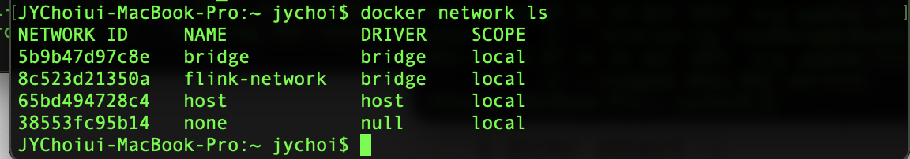

## docker network?

Docker container는 기본적으로 격리된 환경에서 돌아가기 때문에, 다른 container와 통신이 불가능하다. 그렇기 때문에 kafka나 flink를 clustering하기 위해서는 여러 개의
container간 서로 통신이 가능하게 만들어야 하는데 이를 위해서 docker network 명령어를 사용하게 되었다.

network 관련해서 여러가지 명령어가 존재하는데 정확히 알고 쓰기 위해 아래와 같이 정리하였다.

**테스트를 위한 docker image 다운로드**

```bash
### image download
$ docker pull flink
```

**네트워크 생성**

flink session cluster는 동시에 여러 개의 job을 처리할 수 있다. 각각의 job은 cluster가 deploy되고 나서 cluster로 전달되어져야 한다. 이를 위해서 flink
container간 통신을 위해서 아래와 같이 network를 설정해준다.

```bash
### 네트워크 설정 (bridge)
$ FLINK_PROPERTIES="jobmanager.rpc.address: jobmanager"
### docker network create [OPTIONS] NETWORK
$ docker network create flink-network

### job manager(master) 실행
$ docker run \
    --rm \
    --name=jobmanager \
    --network flink-network \
    --publish 8081:8081 \
    --env FLINK_PROPERTIES="${FLINK_PROPERTIES}" \
    flink:latest jobmanager

### TM(worker) 실행
$ docker run \
    --rm \
    --name=taskmanager \
    --network flink-network \
    --env FLINK_PROPERTIES="${FLINK_PROPERTIES}" \
    flink:latest taskmanager
```

**네트워크 조회**

```bash
## 현재 실행 중인 network list 출력
$ docker network ls
```

위의 명령어를 입력하게 되면 아래와 같이 현재 실행 중인 network가 출력된다. `bridge` , `host` , `none` 의 경우에는 docker daemon이 실행되면서 기본으로 생성되는
network이고, `flink-network` 의 경우에는 직접 실행한 명렁어다.

**`bridge`, `host`, `none`의 차이점**

- `bridge` : 하나의 host내에서 여러 container들이 통신하게 하기 위해 사용 (default)
- `host` :  container를 host와 동일한 network에서 돌리기 위해서 사용
- `overlay` : 여러 host에 분산되어 있는 container들간 통신하기 위해 사용

**네트워크 상세 정보 확인**

아래 명령어를 실행하게 되면 임의로 생성했던 flink-network의 정보를 확인할 수 있다. containers를 확인하게 되면 위에서 docker run으로 실행한 jobmanager가 제대로 연결된 걸 확인할
수 있다.

```bash
### 임의로 추가한 flink-network의 상세정보 확인
$ docker network inspect flink-network
[
    {
        "Name": "flink-network",
        "Id": "8c523d21350a54fff7296719f517f3a241400babd1d8645f0afafb536a07a6a3",
        "Created": "2022-01-16T07:28:02.4695645Z",
        "Scope": "local",
        "Driver": "bridge",
        "EnableIPv6": false,
        "IPAM": {
            "Driver": "default",
            "Options": {},
            "Config": [
                {
                    "Subnet": "172.19.0.0/16",
                    "Gateway": "172.19.0.1"
                }
            ]
        },
        "Internal": false,
        "Attachable": false,
        "Ingress": false,
        "ConfigFrom": {
            "Network": ""
        },
        "ConfigOnly": false,
        "Containers": {
            "5414aee5cfa33b4f1ca4eeff3f430c8d591408c06a78cf5883f29bc953b418af": {
                "Name": "jobmanager",
                "EndpointID": "cad11840a9d9e39d707016de26ddf19f915a9d38136f614101f8c63f51d70d52",
                "MacAddress": "02:42:ac:13:00:02",
                "IPv4Address": "172.19.0.2/16",
                "IPv6Address": ""
            }
        },
        "Options": {},
        "Labels": {}
    }
]
```

**네트워크에서 container 연결 해제**

하나의 network에는 당연하게도 여러 container가 붙을 수 있다. 아래의 명령어를 통해서 container에서 network를 제외할 수 있다.

```bash
### docker network disconnect {network_name} {container_name}
$ docker network disconnect flink-network jobmanager
```

**불필요한 네트워크 제거**

network를 설정해주다 보면 어떤 container도 할당되지 않은 network가 존재하는 경우가 있다. 이런 경우는 낭비이므로 아래의 명령어를 통해서 제거해주자

```bash
### 불필요한 network 제거
$ docker network prune
```

### References

- [docker network 사용법](https://www.daleseo.com/docker-networks/)
- [flink docker quickstart](https://nightlies.apache.org/flink/flink-docs-master/docs/deployment/resource-providers/standalone/docker/)
- [docker official docs (network)](https://docs.docker.com/engine/reference/commandline/network/)
