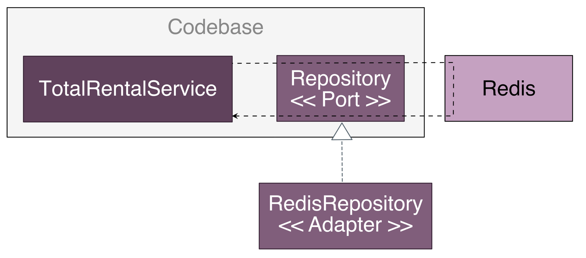

### 2.1 - Microservice Architecture란 무엇인가?

SW Architecture란, 구성 요소 및 그들 간의 dependency로 엮인 고수준의 구조물. multidimmensional한 성격을 가지고 있기 때문에 기술하는 방법도 다양하다. SW의 품질 속성(ex. ~~성)이 Architecture에 의해 결정되기 때문에 Architecture가 중요.

Microservice architecture는 관리성, 테스트성, 배포성이 높은 application을 구축하는 architecture style이다.

**SW architecutre의 정의**

SW architecture의 정의는 sw element와 그들 간의 관계, 그리고 이 둘의 property로 구성된 시스템을 추론하는데 필요한 structure의 집합. (Documenting software Architectures)

그렇기 때문에 분해가 중요한 이유는 아래 두 가지 이유와 같다.

- 업무(labor)와 지식(knowledge)을 분리하여 협업에 유리
- SW element가 어떻게 상호작용하는지 밝힘

**SW architecture의 4+1 view model**

SW architecture를 아래와 같이 4 view + 1 scenario로 나눠서 바라보는 관점.


- logical view: 개발자가 작성한 SW element (ex. class, package, inheritance, association, depends-on과 같은 class-package간의 관계)
- implementation view: 빌드의 결과물 (ex. module, component로 구성되며 module간 dependency와 component-module의 조합 관계도 여기 포함)
- process view: runtime component, 각 element는 개별 process고 IPC를 통해 process간 관계를 나타냄
- deployment view: process가 machine에 매핑되는 방법, 여기서의 element는 실제 physical/virtual machine/process고, 이들 간의 관계는 networking에 의해 이루어짐

**Architecture의 중요성**

Application의 요건은 아래와 같이 크게 두 가지로 나뉘며 Architecture를 어떻게 구성하느냐에 따라 아래의 서비스 품질 요건을 만족시키는 정도가 달라질 수 있다.

- FR: use-case나 user-story format으로 기술하는데, 실제 FR과 architecture는 무관
- 서비스 품질 요건: runime 품질과 개발 시점의 품질 둘 다 해당되며 ~~~성으로 정의된다(ex. 확장성, 신뢰성, 배포성, 관리성, ...)

**Architecutre style 개요**

Architecture style은 해당 style로 만든 instance에서 사용 가능한 component와 connector의 vocabulary, 그리고 이들을 조합할 수 있는 constraint을 결정하게 된다.

microservice architecture는 application을 느슨하게 결합된 여러 service로 구성하는 architecture style이다.

L**ayered Architecture style**

Software element를 계층별로 구성하는 layered architecture style은 모두에게 가장 익숙한 구조의 architecture style로 아래와 같이 구성된 3-layer architecture이 있다.

- presentation layer: UI 및 external API가 구현된 계층
- business logic layer: Business logic이 구현된 계층
- persistence layer: DB 관련 logic이 구현된 계층

하지만 이 style은 아래와 같은 문제점 또한 지니고 있다.

- presentation layer가 하나뿐이라서, application을 호출하는 시스템이 여러 곳일 경우 복잡
- persistence layer가 하나뿐이라서, multi source의 경우 문제가 될 수 있음
- business logic layer가 persistence layer에 의존하는 형태로 정의

**Hexagonal Architecutre style**

logical view를 business logic 중심으로 구성하는 architecture style이다. Application에 presentation layer 대신 business logic을 호출해서 외부 request를 처리하는 inbound adaptor와 presistence layer대신 busniess logic에 의해 호출되고, 외부 application을 호출하는 outbound adaptor를 둔다.

**client-application간 controller와 service의 역할**


**application-persistence간의 service와 repository의 역할**


busniess logic이 adaptor에 전혀 의존하지 않는다는 점이 이 architecture의 가장 중요한 특장점이다.


위와 같은 구조로 이루어져 있으며 Spring MVC를 기준으로 port는 interface, adaptor는 controller라고 보면 쉽게 이해할 수 있을 것 같다.

busniess logic에 있던 presentation/data 접근 logic이 adaptor와 분리되었기 때문에 business logic이 presentation/persistence layer에 존재하지 않는다는 점이다. 이를 통해서 slicing test를 쉽게 할 수 있다.

**Service란 무엇인가?**

아래와 같은 Microservice architecture의 핵심 제약 조건 중 하나는 서비스를 느슨하게 결합한다는 것이다. 이를 위해서는 service가 무엇인가?에 대한 이해가 필요하다.


Service란 command, query, event로 구성된 API를 통해서 client가 원하는 기능을 제공하는 단독 배포가 가능한 SW component이다.

Service API는 내부 구현 상태를 캡슐화한다. 그렇기 때문에 monolith와는 다르게 개발자는 API를 우회해 service에 접근하는 code를 작성할 수 없으므로 module성을 보장할 수 있다.

**Loose Coupling**

앞서 Microservice architecture의 핵심 제약 조건 중 하나가 느슨한 결합이라고 언급하였다. 간단하게 설명한다면 interface를 이용해서 class 간 의존성을 최소화 하는 방법인데, Service는 구현 코드를 감싼 API를 통해서만 서로 통신이 가능하기 때문에 client에 영향을 최소화하여 Service 내부 코드를 바꿀 수 있다.

Service가 DB table을 공유하지 않기에 runtime isolation이 보장되는 장점이 있으나, 여러 service의 data를 모아서 처리하고 전체 data 일관성을 유지하는데 있어서 monolith에 비해서 좀 더 복잡하다는 단점 또한 존재

**Common Library**

일반적으로 여러 module간 중복되는 object가 있을 경우, 공통 module로 빼서 사용하는게 코드의 중복성을 제거하고 유지보수성을 높이는데 도움이 된다고 알려져 있다.

하지만 MSA에서 특정 domain(ex. 여러 service에서 공통적으로 사용하는)의 경우와 같이 변경 가능성이 조금이라도 있는 기능이라면 별도의 서비스로 구현하는 것이 낫다. (DDD에서 여러 Service에서 공통적으로 사용하는 domain의 경우 해당 service에서 사용하는 부분만 떼서 가지고 있는다고 함)

단순한 VO같은 경우에는 공통 library로 빼는게 유리할 것 같기도 함 (ex. ldap이나 oauth같은)

### 2.2 - 마이크로서비스 아키텍처 정의

Microservice architecture를 정의하는 3단계 process를 기반으로 architecture를 정의하는 과정을 설명


- Application requirement를 핵심 요청으로 추출

    추상적인 domain model 관점에서 application이 처리하는 작업을 핵심 요청으로 분리

- 어떻게 여러 서비스로 분해할지 결정

    business 능력에 따라 service를 분해할 수도, DDD 기반으로 하위 Domain별로 service를 분해할 수도 있다. 어떤 전략을 채택하든 최종 결과는 business logic 중심으로 이루어진 service들로 분해된다.

- Service별로 API 정의

    1단계에서 정의된 작업을 각 service에 할당하는 작업으로, 각 service간 IPC를 정하는 과정도 포함된다.


분해 과정은 아래와 같은 허들이 존재함

- Network latency

    Monolithic architecture에 비해서 상대적으로 network 비용이 클 수 밖에 없음, 이런 경우 실제로 분해하기 힘든 경우도 존재함

- Synchronization

    Service간 Synchronization이 필요한 경우 실제 가용성이 떨어지는 문제가 존재, self-contained service를 통해서 해결 가능하다고 함

- Data consistency

    여러 Service에 걸쳐 데이터 일관성을 지켜야 하기 때문에, Saga와 같은 해결책이 있음

- Application 도처에 숨겨져있는 만능 class

    DDD 개념을 적용한다면 쉽게 제거 가능


**시스템 작업 식별**

Application architecture를 정의하는 첫 단추는 시스템 작업을 정의하는 일부터 시작된다. Applying UML and Patterns의 내용에 의하면 아래와 같은 2단계 process를 통해서 시스템 작업을 정의하게 된다.


- 시스템 작업을 기술하기 위해 필요한 vocabulrary를 제공하는 핵심 class로 구성된 고수준의 domain model 작성
- 시스템 작업 식별 후, 해당 동작을 domain model 관점에서 기술

domain model은 주로 user story의 명사에서 도출하게 된다. event storming이라는 기법을 사용해도 무방하다. 시스템 작업은 주로 동사에서 도출되고 주로 domain 객체와 그들 간의 관계로 기술된다.

**고수준 domain model 생성**

아래와 같은 user story(주문하기)를 기반으로 story에 공통적으로 포함되는 명사를 분석하고 시나리오로 확장시킬 수 있다.

```textmate
// given
1. 소비자가 존재
2. 음식점이 존재
3. 음식점은 음식을 주문한 소비자에게 음식을 배달할 수 있다
4. 주문 총액이 음식점의 최소 주문금액 이상

// when
1. 소비자가 음식점에 음식을 주문

// then
1. 소비자 결제수단이 승인
2. 주문이 PENDING_ACCEPTANCE 상태로 생성
3. 생성된 주문이 소비자에 묶임
4. 생성된 주문이 음식점에 묶임
```

위의 user story를 기반으로 Consumer(소비자), Order(주문), Restaurant(음식점), Billing(결제수단) 등의 class가 필요하다는걸 알 수 있다. 이런 story를 기반으로 추가적으로 다른 시나리오로 확장이 가능하고 이를 기반으로 다양한 domain class들을 도출해낼 수 있다.

**시스템 작업 정의**

Application이 어떤 request를 처리할 지 식별하는 단계이며 아래와 같이 크게 두 종류로 나눌 수 있다.

- Command: Data C/U/D
- Query: Data R

시스템 작업을 식별하기 위해서는 user story/scenario에 포함된 동사를 먼저 분석하는 일이 필요하며, 주요 시스템 command는 아래와 같은 표로 정의 가능하다.

Query도 중요하긴 하지만, architecture와 관련된 시스템 작업은 거의 command이기에 아래와 같이 command 위주의 예시를 들게 되었다.


Command는 parameter, return value, 동작 방식의 명세를 domain model class로 정의하게 된다. precondition, postcondition을 추가하여 시스템 작업 명세를 다음과 같이 정의할 수 있다.


고수준 domain model과 시스템 작업을 보면 application이 무슨 일을 하는 지 쉽고 명확하게 알 수 있기 때문에, architecture를 정의하는데 대단히 유용하다.

**서비스 정의: business 능력 pattern별 분해**

2.2 - 마이크로서비스 아키텍처 정의에서 정의했듯이 msa를 구축하는 첫번째 분해 전략은 business 능력에 따라 분해하는 것이다. 통상적으로 business 능력은 특정 busniess class에 집중되고, 여러 하위 class로 분해할 수 있다. (ex. 회계 → 소비자 회계, 음식점 회계, 배달원 회계)

아래와 같이 service를 거의 변하지 않는 business 능력에 따라 구성하면 비교적 안정적인 architecture를 구성할 수 있다.


**서비스 정의: 하위 domain pattern별 분해**

DDD기반으로 modeling을 하고 이를 기반으로 system을 구축하는 방법이다. DDD는 MSA에 적용했을 경우 정말 유용한데, sub-domain과 bounded-context 개념이 존재하기 때문

기존 business별 분해를 할 경우 다양한 service에서 사용하는 하나의 model(ex. 결제)에 대해서 여러 팀 간의 합의를 이끌어내기 힘든 문제점이 존재하는데 DDD를 이용하게 된다면, 범위가 분명한 domain model을 여러 개 정의해서 문제를 해결할 수 있다.


**분해 지침**

business 능력, DDD 기반 domain modeling에 따른 분해 전략은 MSA를 구성하는데 있어 주요 수단이다. 이 밖에도 OOP의 아래 원칙 두 가지를 적용하는 방법이 존재한다.

- Single Responsibility Principle (단일 책임 원칙)

    Class는 오직 하나의 변경 사유를 가져야 한다. → 즉 주문 접수, 주문 준비, 배달 등 다양한 시스템 작업 모두 개별 서비스가 맡아서 처리해야 한다.

- Common Closure Principle (공동 폐쇄 원칙)

    Package의 class들은 동일한 유형의 변경에 대해서 닫혀 있어야 한다. → 즉 어떤 두 class가 동일한 변경 사항에 따라 맞물려서 변경된다면, 동일한 package에 존재하여야 한다는 의미.


**서비스 분해의 장애물**

Business 능력이나 DDD 기반으로 service를 정의해서 architecture를 구성하는 전략은 이론상으로는 완벽해 보이지만, 아래와 같은 장애 요소가 존재한다

- 네트워크 지연

    네트워크 지연은 distributed system의 고질적인 문제, 여러 service를 왔다갔다 하면서 작동하기 때문에 network io가 monolothic architecture에 비해 높음. 이를 해결하기 위해서 batch API를 구현하거나 GRPC같은 IPC를 이용해서 지연시간을 최소화

- 동기 통신으로 인한 가용성 저하

    여러 service간 걸쳐있기 때문에 async messaging등을 통해서 service간 결합도를 낮추고 가용성을 높이는 방법이 권장되어짐

- 여러 service에 걸쳐 data consistency 보장

    여러 service의 data를 업데이트 하는 시스템 작업에 대해서 2PC나 saga를 이용해서 transaction을 관리. 하지만 eventual consistency를 보장한다는 문제점이 존재한다. 어떤 data를 atomic하게 관리하기 위해서는 특정 service내에 두어야 하는데 결국 시스템 간 결합도가 높아지게 된다.

- data의 일관된 view 확보

    위에서의 문제와 같은 맥락인데, 어떤 data를 일관된 view로 보기 위해선 특정한 service 내부에 두어야 하는데 시스템 간 결합도를 높이는 문제를 가져올 수 있다.

- 만능 class의 존재

    Application 전역에서 사용되는 만능 class는 그 존재만으로도 분해의 걸림돌이 되게 된다. → DDD를 적용해서 각 service가 자체 domain model을 가지고 있는 개별 sub domain으로 취급하는 방안이 존재

    Order의 경우 모든 service에 존재하게 되는데 각 service에서 각자가 필요한 부분만 가지고 있는 domain model을 따로 두게 설계.

    

**Service API 정의**

시스템 작업과 service 후보를 목록화 한 후, 각 service별 API를 정의하게 된다. 각각의 시스템 작업을 service로 매핑한 후, 해당 시스템 작업을 구현하기 위해서는 어떤 service가 서로 협력해야 하는지 파악해야 하는 작업이 선행되어야 한다.

**시스템 작업을 service로 배정**

어떤 service가 request의 진입점인지 결정해야 함, 매핑 관계가 애매한 경우도 존재하게 되는데 어떤 작업이 제공하는 정보가 필요한 service에 해당 작업을 배정하는 것이 합리적인 경우도 있으나 작업을 처리하는데 필요한 정보를 갖고 있는 service에 배정하는 경우가 더 합리적인 경우도 존재한다.

시스템 작업을 각 service에 배정한 후, 각 시스템 작업을 처리하기 위해서 service가 어떻게 협력해야 하는지 정하는 과정을 진행하게 된다.

**Service 간 협동 지원에 필요한 API 확정**

Service 하나로 전부 처리가 가능한 작업도 존재하나 여러 service를 거쳐서 작업이 완료되는 경우도 존재한다. 시스템 작업 정의를 하며 precondition과 postcondition을 정의하였었는데 이를 기반으로 아래와 같은 표를 만들어서 진행할 수 있다.


**References**

- 마이크로서비스 패턴 (크리스 리차드슨 저)
- 지속 가능한 소프트웨어 설계 패턴: 포트와 어댑터 아키텍처 적용하기[https://engineering.linecorp.com/ko/blog/port-and-adapter-architecture/](https://engineering.linecorp.com/ko/blog/port-and-adapter-architecture/)
