### 3.1 MSA IPC 개요

**상호 작용 스타일**

Service API에 알맞은 IPC를 선택하기 전에 client/service간 상호 작용 스타일을 잘 살펴보면, Requirements에서 벗어나는 일 없이 개발이 가능하다. client/service간 상호 작용 스타일은 아래와 같이 두 가지 기준으로 분류가 가능하다.

- One-to-One/One-to-Many 여부
  - One-to-One: 각 client request는 정확히 한 service가 처리하는 구조이며 sync, async, one-way notification의 세 가지 종류를 가진다.
  - One-to-Many: 각 client request를 여러 service가 협동하여 처리하는 구조이며 pub/sub 구조, publish/async response의 두 가지 종류를 가진다.
- Synchronous/Asynchronous 여부
  - Synchronous:  Client는 service가 제 시간에 응답할걸 기대하고 대기 도중 blocking할 수 있음
  - Asynchronous: Client가 response가 올 때 까지 blocking하지 않고 바로 처리, response는 즉시 전송되지 않아도 됨(ex. callback)

**MSA API 정의**

Monolothic에서는 client-service간 API의 명세가 맞지 않는다면 compile time에 알아챌 수 있지만, MSA에서는 별도의 process, module로 분리되어 있기 때문에 runtime time에 직접 장애를 맞고서 알아챌 수 있다. 그렇기 때문에 어떤 IPC를 채택하든 service API를 IDL을 통해서 정확히 정의해야 한다. (API 우선 방식)

**API 발전시키기**

API는 불변이 아니기 때문에 지속적으로 변화하게 되어있다. monolothic에 비해서 한 번 만든 service API를 변경하는 일은 시간과 비용이 많이 들게 되어있다. 보통 이러한 문제 때문에 하위 호환성을 고려하여 API를 설계해야 한다.

- Symentic versioning

  원래는 SW package의 versioning 용도로 사용되었지만, distribution system의 API versioning에도 사용할 수 있다. versioning 규칙은 Major(하위 호환이 되지 않는 중대 변경), Minor(하위 호환이 가능한 변경), Patch(하위 호환이 가능한 bug fix등 사소한 업데이트) 세 파트로 구성하고 규칙에 따라 증가시키며, 이러한 version 정보를 url path나 header등에 실어 보낼 수 있다.

- 하위 호환이 가능한 소규모 변경

  Robustness principle에 근거해서 request 속성이 누락되거나 해도 service에서는 기본값을 제공하고, 필요 없는 속성을 넘겨주더라도 무시해야 한다. request/response format을 이용(ex. API doc)하게 된다면 잘 지켜질 수 있다.

- 중대한 대규모 변경

  하위 호환이 지원되지 않는 API를 개발하게 될 경우, client의 버전을 강제로 올릴 수 없기 때문에 하위 호환성을 위해 old-new 두 버전의 API를 모두 지원해야 한다. url path나 HTTP content negotiation(MIME type 내부에 version 정보 끼워넣는 방법)


**Message format**

IPC의 핵심은 message exchange이며, IPC의 종류에 따라 message format이 정해져있는 경우도 존재한다. 하지만 설계 단계에서는 어떤 변경사항이 있을 지 모르기 때문에 특정 언어에 종속적인 format이 아닌 cross-language-format을 선택하는게 중요하다. message format은 크게 아래의 두 가지가 존재한다.

- Test message format

  JSON/XML등 text based format의 경우, self-describing하기 때문에 readable한 장점이 존재한다. consumer는 필요한 값만 읽어 사용하면 되기 때문에 schema가 자주 바뀌어도 하위 호환성이 쉽게 보장된다. (XML과 같이 schema 형식이 필요하다는 주장이 나와서 JSON schema 표준이 제정). binary format에 비해서는 overhead가 다소 크기 때문에 효율성이 필요한 부분에서는 이를 고려하는 것이 좋다.

- Binary message format

  종류가 다양하지만 가장 유명한건 protobuf, avro가 유명하다. 이 두 format 모두 type IDL을 제공하며, compiler는 message를 serialize/deserialize하는 code를 생성한다. Java와 같은 static type language를 사용하는 경우 compiler단에서 제대로 사용하고 있는 지 check가 가능하다. avro의 경우 schema를 알고 있어야 message를 해석할 수 있기 때문에 발전 가능성 측면에서는 protobuf가 가장 유리하다고 볼 수 있다.


### 3.2 Synchronous RPI pattern 응용 통신

RPI란 client가 service에 request를 보내면 service가 해당 request를 처리하고 이에 대한 response를 보내는 IPC이다. 간단하게 아래와 같은 flow를 가지고 있다.

1. Client의 business logic에서 proxy interface(RPI proxy adaptor class로 구현되어 있음)를 호출
2. RPI proxy가 service에 전달한 request는 RPI server adaptor class가 받고, 이를 다시 service interface를 통해서 business logic을 호출
3. logic 처리를 마친 service는 다시 RPI proxy를 통해 client business logic에 response를 반환한다.

**Sync RPI(REST) pattern**

가장 대중적으로 사용하고 있는 방식이며, REST는 http 기반으로 소통하는 IPC이다. 보통 business object들로 이루어져 있는 resouces를 기반으로 api endpoint를 만들고 이를 XML이나 JSON 기반 message format을 이용하여 통신하게 된다.

**REST 성숙도 모델**

RESTful하다는 의미에 대해서 명확하게 정의할 수 있는 아래와 같은 모델이 존재하며 4단계로 성숙도가 나뉘게 된다.

- Level 0: Client는 service별로 유일한 endpoint에 POST method를 이용해서 service를 호출한다.
- Level 1: Service는 resource 개념을 지원한다. (client는 수행할 action과 parameter가 지정된 POST 요청을 수행)
- Level 2: Service는 http method를 이용해서 action을 수행하고, caching등의 web infra를 이용할 수 있다.
- Level 3: HATEOAS에 기반해서 Service API를 설계한다.

**REST API**

앞서 API는 IDL로 정의되어야 한다고 하였는데, 원래 기본적으로 SOAP등의 오래된 protocol과는 다르게 REST는 IDL이 존재하지 않았다. 하지만 Swagger등을 이용한 Open API specification이 REST IDL로 널리 보급되어 있다.

**Request 한 번으로 많은 resource를 가져오기 힘들다.**

REST resource는 business object 중심이다. 이에 반해 실제 business logic은 연관된 resources 여러 개를 요구로 하는 경우가 많다. 순수 REST API 설계에 따르면 관련된 resource마다 요청 하나가 매칭되어야 하기 때문에 시나리오가 복잡해지는 경우에는 latency가 높아지고 비효율적이 될 수 있다. 이를 해결하기 위해서 아래와 같이 uri에 관련 resource를 기술하여 같이 가져오는 방식이 존재하나, 효율이 떨어지고 구현과정이 복잡하고 시간이 많이 걸리는 문제가 존재한다.

```bash
GET /orders/order-id/1345?expand=customer
```

이러한 문제를 해결하기 위해서 GQL이나 Falcor같은 대체 API 기술이 각광받고 있다.

**작업을 http verb에 매핑하기 어렵다.**

business object에 수행할 작업을 http verb에 어떻게 매핑할지도 어려운 문제이다. REST API에서 데이터를 수정하는 경우 보통 PUT, PATCH등의 verb를 사용하나, 실제로 data를 update하는 경로가 여러 가지가 될 수 있다. 또한 PUT 사용 시 idempotency를 보장하지 못하는 update도 존재한다.

이를 해결하기 위해서 resource의 특정 part를 update할 때 아래와 같이 sub-resource를 기술하는 방법이 있다.

```bash
# 주문 취소
POST /orders/{orderId}/cancel

# 주문 변경
POST /orders/{orderId}/revise

# anti pattern (verb in parameter)
POST /orders/{orderId}?type=revise
```

verb를 url query parameter에 넣는 경우도 있지만, REST 원칙엔 맞지 않아서 gRPC같은 대체 REST 기술이 각광받고 있다.

**REST의 장단점**

REST는 아래와 같은 장단점을 가지고 있다.

**장점**

- 단순하고 익숙
- Postman이나, curl 등의 cli를 이용해서 쉽게 테스트할 수 있음
- req/res 스타일의 통신을 직접 지원
- firewall friendly하다. (단일 port 사용 및 internet에서 직접 server access가 가능하고, TCP를 사용하는 등 firewall 입장에서 쉽게 접근 가능하다)
- 중간 broker가 존재하지 않기 때문에 architecture가 상대적으로 간단하다.

**단점**

- req/res 방식의 통신만 제공
- Low availability(message를 buffering하는게 없기 때문에 client/server 모두 live 상태가 보장되어야 함)
- Service instance들의 URL을 client가 모두 알고 있어야 함(요즘엔 cloud 기반이라 동적으로 public ip가 유동적이라는 문제가 있어서 service discovery를 통해서 해결)
- 요청 한 번으로 필요한 resources를 모두 가져오기 힘들다
- 다중 update 작업을 http verb에 매핑하기 어렵다.

**Sync RPI(gRPC) pattern**

gRPC는 앞서 REST의 문제점으로 지적되었던 http verb의 한정된 매핑 때문에 다양한 update를 지원하는 REST API를 설계하기 어렵다는 문제점을 해결하기 위해 등장한 framework이다.

특정 language에 종속적이지 않고 binary message format 기반이기 때문에 API 우선 방식으로 설계할 수 있다는 장점이 존재한다.

gRPC API는 protocol buffer를 serialize/deserialize 하는 IDL을 기반으로 정의되며, protocol buffer compiler를 이용해서 client쪽 stub 및 server쪽 skeleton을 생성할 수 있다.

gRPC는 아래와 같은 장단점이 존재한다.

**장점**

- 다양한 update 작업이 포함된 API를 설계하기 쉽다.
- Size가 큰 message를 교환할 때 효율적이다.
- 양방향 streaming 덕분에 RPI, messaging 둘 다 가능
- 다양한 language로 작성된 client/server간 연동이 가능

**단점**

- JS client가 REST/JSON 기반 API에 비해 load가 많이 걸린다.
- 방화벽에 따라 http2를 지원하지 않는 경우가 존재

**부분 실패 처리: circuit breaker pattern**

Distributed system에서는 service가 다른 service를 sync 호출할 때, 부분적으로 실패하는 경우가 항상 존재한다는 문제점이 있다.

응답 대기 중, 장애가 다른 service로 전파되며 전체 system에 영향을 끼치는 경우가 존재한다. 이를 해결하기 위한 방법 중 하나가 circuit breaker이다.

Circuit breaker란 연속 실패 횟수가 주어진 threshold를 초과하면 일정 시간동안 call을 바로 거부하는 RPI proxy이다.

**견고한 RPI proxy 설계**

Service가 다른 service를 sync로 호출하는 경우, 자기 자신을 방어하는 방법이 명확하게 기술되어 있다.

- Network timeout: Response 대기 중, 무한정 기다리는 것이 아닌 timeout까지만 기다림
- Outstanding request 개수 제한: Client가 특정 service에 요청 가능한 미처리 request의 최대 개수를 설정
- Circuit breaker pattern: 성공/실패 request 개수를 monitoring하다가 error rate가 threshold를 초과하는 경우, 그 이후의 시도에 대해선 바로 실패 처리를 하는 방식. timeout 이후 client가 재시도해서 성공하는 경우 circuit은 다시 닫힘

**불능 Service 복구**

Hystrix같은 library가 유명하긴 하나 silver bullet은 아니며, 그때그때 상황에 맞게 판단해야한다. 부분 실패에 대해서 cached된 response나 default value를 반환하는 방법도 존재한다.

**Service discovery**

IDC같이 물리적인 서버를 기반으로 System을 구성하던 시절에는 고려하지 않아도 될 문제였으나, 지금처럼 cloud 기반 system에서는 instance의 ip가 유동적으로 바뀌기 때문에 client쪽에 Service discovery가 필수적으로 요구된다.

**Service discovery 개요**

Service discovery mechanism(Application service instance의 network 위치를 DB화한 service registry를 이용)을 통해서 구현된다.

Service instance가 시작/종료될 때 registry가 갱신되며, client가 service를 호출하는 경우 registry에서 가용 instance 목록을 불러오고 그 중 하나로 routing하게 된다.

주로 아래와 같이 두 가지 방법으로 구현된다.

- Client/Service가 직접 registry와 상호작용
- deploy infra를 이용해서 service discovery를 처리

**Application 수준의 Service discovery pattern 적용**

아래 설명된 discovery pattern의 경우, 두 가지 patttern이 조합되어 있는 형태이다.

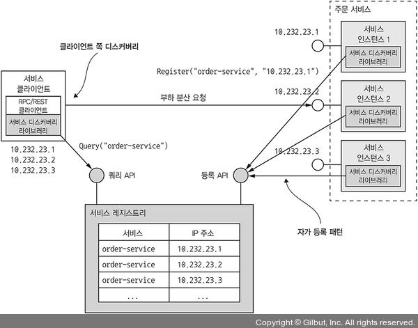

- Self registration pattern

  각 service instance는 자신의 network 위치를 registry 등록 API를 호출해서 등록한다. 이외에도 health-check를 제공하는 service도 존재한다.

- Client side discovery pattern

  Client가 service를 호출할 때 먼저 registry에 instance 목록을 넘겨받게 된다. client는 rr이나 random 알고리즘을 이용해서 load balacing을 수행하게 된다.


Spring cloud에서 이러한 Application side에서의 service discovery를 잘 구현해 놨는데, 여러 cloud platform을 지원하거나 hybrid cloud 환경에서 처리가 용이한 장점을 가지고 있다.

하지만 language dependency가 존재하고, 관리 point가 늘어난다는 단점이 존재하기 때문에 되도록이면 managed service를 이용하는 것이 편리하다.

**Platform에 내장된 service discovery pattern 적용**

docker나 k8s에는 대부분 service discovery가 탑재되어 있다. deploy platform은 DNS name, VIP, VIP로 해석되는 DNS name을 각 service에 부여하게 되는데 delploy platform에서는 알아서 가용 service instance 중 하나로 요청을 routing하게 된다.

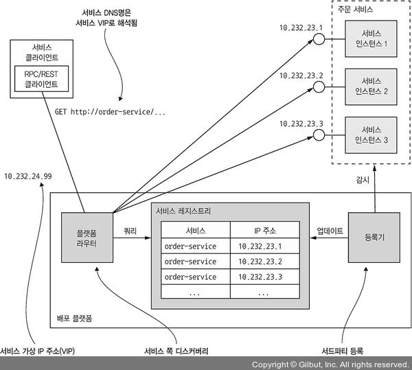

위 그림같은 구조를 가지게 되는데 이 방식은 아래의 두 가지 pattern을 접목시킨 방법이다.

- Third party registration pattern

  Service가 자신을 registry에 등록하는 것이 아닌, deploy platform의 registrar가 대행해주는 방식

- Server side discovery pattern

  Client가 service registry를 query하는게 아니라 DNS name을 request하게 된다. 그 후 service registry를 query하고 load balancing하는 router로 넘기게 된다.


이것 또한 client-side discovery pattern에서 다뤘던 내용과 같이 관리 point를 줄일 수 있다는 관점에서 cloud managed service를 이용하는게 유리하다.

### 3.3 Asynchronous Messaging pattern 응용 통신

Messaging기반의 Application은 보통 service 간 중개 역할을 하는 broker를 사용하나 service에 따라서는 brokerless architecture를 이용하기도 한다.

이 pattern에서는 client가 response를 바로 받지 못할거라는 전제로부터 출발한다.

**Messaging 개요**

Message는 message channel을 통해 교환된다. message는 header와 body로 구성된다. 주로 header는 meta data에 해당되는 값들이 저장되며 body에는 실제 data가 저장된다. message의 종류는 아래와 같이 정리할 수 있다.

- Document: data만 포함된 generic한 message. 이 message에 대한 해석의 주체는 subscriber이다.
- Command: RPC request와 동등한 message. 호출해야 할 작업과 parameter가 지정되어 있음
- Event: Subscriber에게 어떤 event가 발생했다는 사실을 전달해주는 message이며, 주로 domain object의 상태 변화를 다룸.

**Message channel**

아래의 그림과 같이 Message는 channel을 통해서 data를 교환하게 된다. Sender→Receiver로 message가 전송되는 자세한 과정은 아래와 같다.

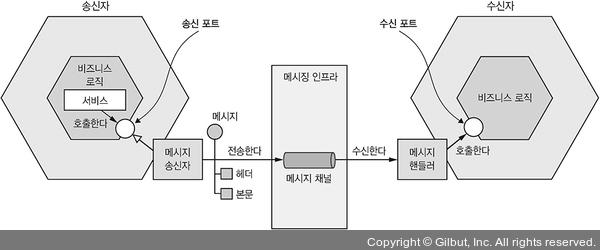

1. Sender의 business logic은 adaptor로 구현된 port interface를 호출.
2. Sender는 message channel을 통해서 receiver에게 data 전송.
3. Receiver의 message handler adaptor가 message를 처리.
4. Receiver의 business logic port interface 호출.

Message channel은 크게 두 종류가 존재한다.

- Point-to-point: Channel을 읽고 있는 Consumer 중 하나를 지정하여 전송, 앞서 IPC에서 소개했던 One-to-one 방식이 이에 해당된다.
- publish-subscribe: 같은 channel을 읽고 있는 모든 consumer에 전송, 앞서 IPC에서 소개했던 One-to-many 방식이 이에 해당된다.

**Messaging 상호 작용 style 구현**

Messaging은 유연한 style이기 때문에 아래의 예시와 같이 messaging으로 직접 구현하거나, messaging을 토대로 구현할 수 있다.

- Sync/Async req/res

  Messaging은 기본적으로 Async한 속성이지만, response를 수신할 때 까지 client를 blocking을 하여 Sync하게 구현할 수 있다.

- One-way notification

  Service는 별도의 response를 반환하지 않으며, Async messaging을 통해서 쉽게 구현할 수 있다.

- Publish/Subscribe

  Service는 자신이 담당하고 있는 domain object의 channel을 subscribe하고 있으며, 변동이 있는 경우 이 channel의 data를 기준으로 변경하게 된다.

- Publish/Async response

  Pub-sub 구조와 req/res를 조합한 style이다. 간단하게 예시를 들자면, client는 response channel header가 명시된 message를 channel에 보내게 되고, consumer는 해당 key가 포함된 response message를 지정된 channel에 뿌리게 된다. 이를 client는 다시 받아서 response message와 조합하게 된다.


**Messaging 기반 service의 API Specification 작성**

REST, OpenAPI와는 다르게 Channel/Message type은 딱히 정해진 문서화 표준이 없기 때문에 상대적으로 간단하게 서술 가능하다.

Async API의 경우 크게 Command와 Event로 나눌 수 있는데, 서로 문서화하는 방법이 약간 다르다.

- Async command

  크게 req/Async res API, one-way notification API 두 가지로 나눌 수 있다.

  전자의 경우, service command message channel, command message의 type/format, service가 return하는 message의 type/format으로 이루어져 있다.

  후자의 경우, service의 command message channel, service가 수신하는 command message의 type/format으로 이루어진다.

- Event

  위에서 기술한 Async command와 다르지 않게 channel 정보, message의 type/format을 기술하게 된다.


**Message broker**

Messaging 기반 Application에서는 service to service로 직접 통신하는 방식인 brokerless 방식과 broker를 통해 통신하는 방식 두 가지로 크게 나뉘게 된다.

brokerless 방식은 broker를 거치지 않기 때문에 좀 더 좋은 성능을 낼 수 있고, broker 자체가 SPOF가 될 일이 없으며, broker를 따로 운영하는 것 보다 운영 복잡도가 낮다는 장점을 가지고 있다.

그러나 Service discovery를 가지고 있어야 하며, guaranteed delivery같은 mechanism을 구현하기가 힘들다는 단점이 존재한다.

이 중 일반적으로 broker를 사용하는 방식이 많이 쓰이고 있으며, 권장된다.

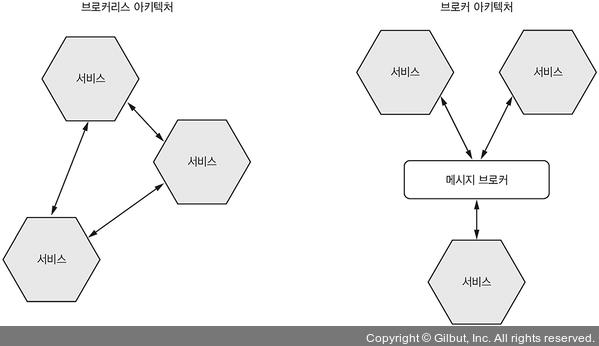

**Broker 기반 messaging 개요**

Broker기반 messaging의 장점은 sender가 receiver의 network 위치를 몰라도 된다는 점과 broker에 message를 적재하여 consumer가 message를 처리할 수 있을 때 까지 buffering을 할 수 있다는 점 두 가지를 가지고 있다.

broker를 선택하는 기준은 protocol, language, message 순서, guaranteed delivery, persistence등 여러 가지가 있으나 messaging 순서 유지 및 확장성은 필수 요건이다.

**Broker 기반 messaging의 장단점**

장점

- 느슨한 결합: client는 service instance를 몰라도 그냥 적절한 channel에 message를 뿌려주는 방식으로 request를 하게 된다. service discovery mechanism조차도 필요가 없다는 장점이 존재한다.
- Message buffering: HTTP같은 경우에는 client와 server가 모두 살아있어야 하지만, broker를 이용한 messaging의 경우에는 그냥 모두 buffering하고 처리할 수 있을 때 가져가서 처리하기 때문에 내결함성이 높다.
- 유연한 통신: 다양한 상호 작용 style(one-to-one, one-to-many, ...)등을 모두 지원
- 명시적인 IPC: RPC의 경우, remote service가 마치 자신이 local에 같이 있는 것 처럼 request를 하게 되는데 실제 service와는 다르다.

단점

- bottleneck의 가능성: 요즘 broker의 경우 확장성이 뛰어나기 때문에 크게 문제가 되지 않음.
- SPOF의 가능성: 요즘 broker의 경우 high-availablity를 보장하게 설계되었기 때문에 크게 문제가 되지 않음.
- 운영 복잡도 증가: messaging system을 구축하기 위한 별도의 과정 필요(ex. zookeeper)

**Receiver 경합과 message 순서 유지 (p.313)**

message 순서를 보장하면서, receiver를 scale-out할 수 있느냐는 매우 중요한 이슈이다. Kafka나 Kinesis같은 message broker에서는 sharding(partitioning)을 이용해서 문제를 해결하고 있다. 작동 과정은 아래와 같다.

1. Sharding된 channel은 여러 개의 shard로 이루어지며, 각 shard는 channel처럼 작동한다.
2. Receiver는 message header에 shard key를 지정하게 된다. broker는 message를 shard key별로 shard/partition에 할당하게 된다.
3. Broker는 여러 receiver instance를 묶어서 동일한 receiver처럼 취급(ex. consumer group)

**중복 message 처리**

Message broker는 보통 at least once 전략을 기본으로 채택하고 있다. broker가 message를 재전송 할 때, 원래 순서를 보장해야 이상적이라고 할 수 있다. 이를 위해서 중복 message를 처리하는 방법은 아래와 같이 두 가지가 존재한다.

- Idempotent를 보장하는 message handler를 작성

  Application의 message 처리 방식이 idempotent하면 중복 message는 크게 문제가 되지 않는다. 하지만 실제로 이렇게 idempotent한 logic은 거의 존재하지 않는다.

- Message를 tracking하고 중복된 message를 제거.

  중복 message를 걸러내는 handler는 db등을 이용해서 consumer가 message id를 이용해서 해당 message 처리 여부를 추적하는 방식으로 구현이 가능하다. NoSQL같이 단일 transaction을 이용해 여러 DB를 동시에 update가 불가한 경우에는 일반 application table을 이용해서 해결할 수 있다.


**Transactional messaging**

Service는 보통 DB를 update하는 transaction의 일부로 message를 발행하게 된다. message와 실제 db transaction을 한 transaction으로 묶지 않는다면, data consistency를 해쳐 시스템 장애가 날 수도 있다.

이를 해결하기 위해 Application에서 message를 확실하게 발행하는 방법은 아래의 방법들이 존재한다.

**DB table을 message queue로 활용(transactional outbox pattern)**

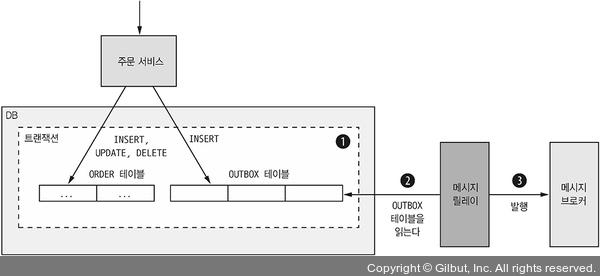

RDBMS 기반의 application이라면 DB table을 임시 message queue로 활용할 수 있다. message를 보내는 service에 `outbox` 란 table을 생성하고, business object를 CUD하는 transaction을 해당 table에 적재한다. 이 작업 자체는 local ACID transaction이기 때문에 atomicity가 보장되게 된다.

이후 message relay는 지속적으로 해당 table을 읽고 broker에 publish한다.

message를 DB에서 broker로 쏘는 방법은 아래와 같이 크게 두 가지로 나뉜다.

**Polling publisher pattern**

가장 간단한 방법으로, 주기적으로 `outbox` table을 polling하면서 publish되지 않은 message를 broker로 전송하는 방법이다. 이 작업의 경우 DB connection을 지속적으로 사용하기 때문에 상대적으로 비용이 크고, 만약 table 단위가 아닌 복잡한 business entity를 query한다면 기술적으로 불가능할 수도 있다.

**Transaction log tailing pattern**

Polling보다 좀 더 정교한 방법으로, Message relay로 DB transaction log(commit log)를 tailing하는 방법이다. application단에서 commit된 update는 결국 실제 DB의 log entry에 쌓이게 되는데, transaction log minor를 이용해서 update분을 하나씩 broker에 보내는 방식이다.

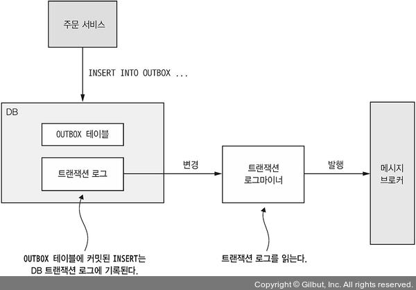

실제로 DynamoDB streams같은 경우 해당 방법을 사용하고 있다. 하지만 개발 공수가 polling에 비해 높다는 단점 또한 존재한다.

**Messaging library/framework**

Broker 자체에도 client library가 존재하나, 이걸 직접 사용한다면 아래와 같은 문제가 존재한다.

- Broker API에 message를 publish하는 business logic이 client library와 결합
- Broker의 client API는 대개 low-level이고, code가 상대적으로 복잡하기 때문에 high-level 수준에서의 상호 작용 style은 지원하지 않음

### 3.4 Asynchronous로 availability 개선

MSA 환경에서 Synchoronous한 통신을 하게 되면 다음과 같은 문제들이 생겨 availability가 떨어지게 된다.

REST는 간단하고 쉽지만, 기본적으로 sync protocol이라는 문제점이 존재한다. 여러 service의 data를 모아서 처리해야 하는 경우, blocking된다면 low availability가 될 수 밖에 없다. 사실 REST 뿐만 아니라 client가 다른 service의 response를 이용하게 된다면 생길 수 있는 공통적인 문제이다.

Async API만 존재하는 service를 정의하는 방법도 있겠지만, public API의 경우 대개 Synchronous하기 때문에 불가능한 경우가 많은데 Asynchronous 상호 작용 style을 통해서 해결할 수 있다.

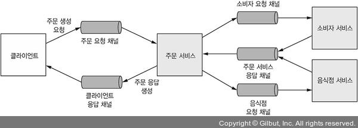

REST call이 아닌 messaging channel을 통해서 처리하는 경우, 어느 쪽도 response를 기다리며 blocking되지 않는다. 하지만 public API같은 경우에는 request가 온 시점에 바로 response를 내려줘야 하는 경우도 존재한다. 이런 경우에는 아래와 같이 data replication을 이용해서 해결한다.

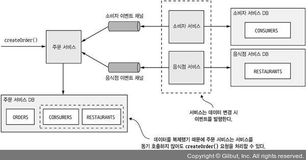

위와 같이 service 요청 처리에 필요한 data의 replica를 가지게 된다면(self-contained), response를 바로 내려줘야 하는 경우에도 해결이 가능하다. 그러나 replication의 경우, 만약 data가 방대하다면 문제가 생길 수 있고, data consistency에 대해서 보장해 줄 수 있는 방법이 필요하다.

이러한 문제에 대한 해결 방안 중 하나는, client에 response하기 전 까지 다른 service와의 상호 작용을 지연시키는 방법이다.

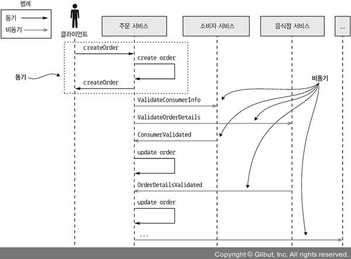

request 처리 중 다른 service와 sync 통신을 하지 않고, 다른 service에 message를 async하게 보내게 된다. 이렇게 하면 기존의 문제점이던 strongly coupled를 해결할 수 있다.

이렇게 한다면 client는 필수 정보만을 가지게 되는 문제점이 존재하는데, 이는 polling이나 service에서 notification을 보내주는 방향으로 해결할 수 있다. 상대적으로 복잡해 보일 수 있지만 distribution transaction 처리 이슈 또한 이러한 방법으로 해결할 수 있기 때문에 best-practice에 가장 가깝다.

### Q&A

- API 우선 방식이란?

  전통적인 개발 방식 (top-down)이 아닌, Client/Service를 구축하기 전에 API 먼저 설계하고 구성하는 방식이다. 이 방식을 채택하면 얻을 수 있는 장점으로는 아래와 같은 것들이 존재함.
  전체 architecture가 잡히고 진행하는 것이 아닌, 이해관계자끼리 정의한 API 명세를 기반으로 개발을 병렬로 진행하여 빠르게 개발을 진행할 수 있으며 잘 정의된 API doc을 이용한다면 이를 기반으로 확장하는데도 유리할 수 있음

  API를 First class object로 보는 관점이며, 다른 객체들에 일반적으로 적용 가능한 연산을 모두 지원하는 객체를 가리킨다.
  보통 함수에 인자로 넘기기, 수정하기, 변수에 대입하기와 같은 연산을 지원할 때 일급 객체라고 한다.

- Falcor, GQL이 과연 완벽한 대체재가 될 수 있을까?

  FE쪽에 힘을 좀 더 실어주는 느낌, 참고 문서가 2019년이라 지금과 좀 차이는 있을 수 있음. React가 확 떴을 때 같이 떴으나 지금은...? 그 당시만큼은 아닌 느낌

  - REST에서의 Caching전략이 그대로 사용 불가능한 점(대체재로 `persisted query`, `Apollo engine`)
  - request filtering의 어려움

  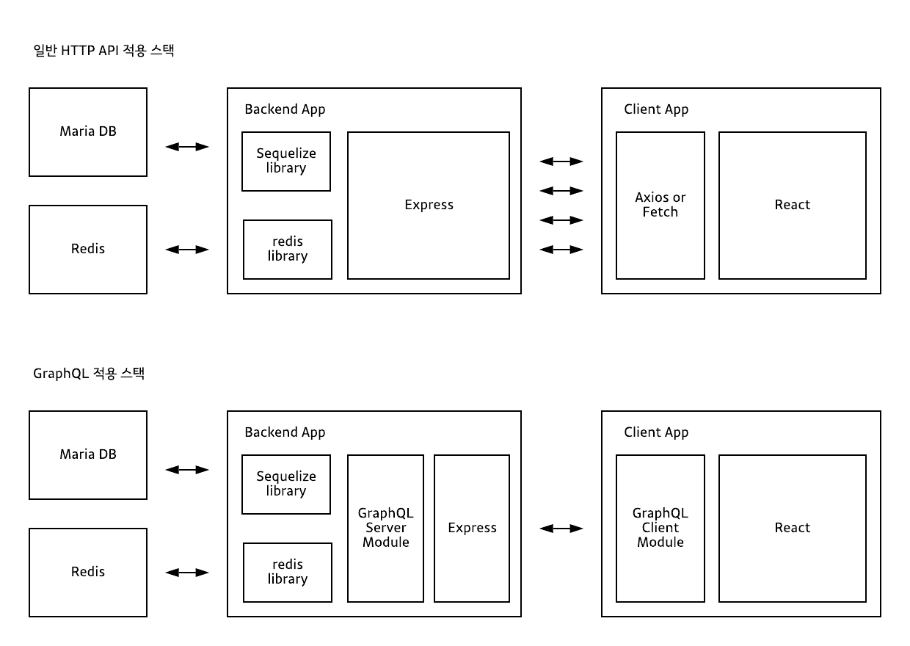

  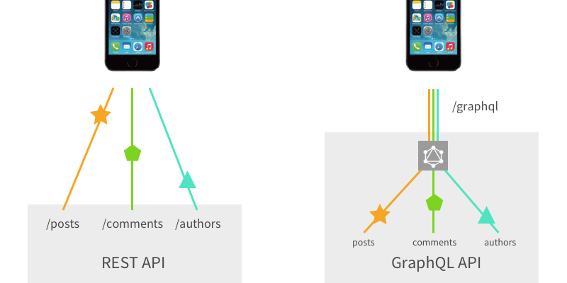


### References

- 마이크로서비스 패턴 (크리스 리차드슨 저)
- Understanding the API-First Approach to Building Products ([https://swagger.io/resources/articles/adopting-an-api-first-approach/](https://swagger.io/resources/articles/adopting-an-api-first-approach/))
- GraphQL 개념잡기 ([https://tech.kakao.com/2019/08/01/graphql-basic/](https://tech.kakao.com/2019/08/01/graphql-basic/))
