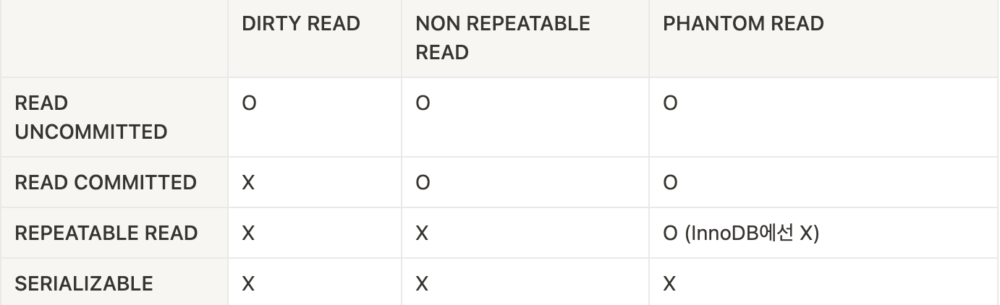

Transaction의 isolation level이란, 여러 transaction이 동시에 처리될 때, 특정 transaction이 다른 transaction에서 변경하거나, 조회하는 데이터를 볼 수 있게 허용할지 말지를 결정하는 것이다.

Isolation level은 크게 `READ UNCOMMITTED` , `READ COMMITTED` , `REPEATABLE READ` , `SERIALIZABLE` 의 4 level로 나뉘게 된다.

Oracle, MySQL의 경우 default로 `REPEATABLE READ`를 채택하고 있으며, H2의 경우 `READ COMMITTED`를 채택하고 있다.

`DIRTY READ` 라고도 부르는 `READ UNCOMMITTED` 의 경우 일반적인 DB에서는 거의 사용하지 않으며, `SERIALIZABLE` 또한 동시성 이슈 때문에 일반적인 DB에서는 잘 사용하지 않는다. 사실 뒤로 갈 수록 동시 처리 성능이 떨어질거라 생각할 수 있는데, 실제로는 `SERIALIZABLE` 이 아닌 이상 크게 성능상에 차이는 없다. 그렇기 때문에 일반적인 서비스를 개발할 때는 보통 `READ COMMITTED` , `REPEATABLE READ` 이 두 가지 level을 채택하고 있다.

DB의 isolation level을 얘기할 때 항상 언급되는 아래와 같은 3가지 data consistency 관련 문제가 존재하는데 아래의 표와 같이 isolation level 설정에 따라 일어날 수도 일어나지 않을 수도 있다.

- DIRTY READ
- NON-RETEATABLE READ
- PHANTOM READ



**READ UNCOMMITTED**

`READ UNCOMMITTED` level에서는 각 transaction의 변경 내용이 `COMMIT`이나 `ROLLBACK` 여부에 상관없이 다른 transaction에서 조회 가능하다.

아래와 같은 예제 code를 통해서 확인할 수 있다.

```sql
-- DDL
create table Card
(
    id        bigint auto_increment
        primary key,
    cardType  varchar(255) null,
    createdAt datetime(6)  null,
    name      varchar(255) null
);

-- 테스트를 위해서 auto commit off
SET autocommit = OFF;

-- user 1 (insert new record)
insert Card values (11, 'check', now(), 'test');

-- user 2 (아직 commit되지 않은 record에 대한 조회가 가능)
select * from Card where id=11;

-- user 1의 transaction이 rollback(문제 발생)
rollback;
```

위 시나리오를 간단하게 설명한다면, user 1이 새로운 record에 대한 DML을 수행하고 있는데 아직 commit되기 전에 user 2가 해당 record를 읽어서 처리를 수행하였는데, user 1의 insert record 처리 도중 오류가 발생해 rollback된 시나리오이다.

만약 user1의 transaction이 정상적이었다면, 문제가 없을 수 있으나 위의 케이스와 같은 경우에선 시스템 장애로 이어질 수 있다는 문제가 존재한다.


**READ COMMITTED**

Oracle에서 기본적으로 사용하고 있는 isolation level이며, 가장 널리 사용되고 있는 level이다.

이 level에서는 commit이 완료된 record에 대해서만 다른 transaction에서 조회가 가능하기 때문에 위에서의 `DIRTY READ` 와 같은 문제는 발생하지 않는다.

이 level에서는 `NON REPEATABLE READ` data consistency 문제가 존재하는데, 아래와 같은 시나리오에서 발생한다.

```sql
SET autocommit = OFF;

-- user 1
start transaction;

-- 기존 row는 'credit'이기 때문에 result는 0건
select * from Card where cardType = 'check';

-- user 2 transaction commit 이후 다시 조회하면 1건 조회
select * from Card where cardType = 'check';

commit;

-- user 2
set autocommit = OFF;
start transaction;

update Card set cardType = 'check' where id=11;
commit;
```

위 시나리오에서 user1의 하나의 transaction안에서 SELECT query를 동일하게 실행하는 경우에는 항상 같은 결과를 가져와야 하나 결과가 다르게 나오고 있다.

일반적으로 금융같이 data consistency가 엄격하게 보장되어야 하는 도메인이 아니고서는 위의 문제는 비즈니스 로직에서 처리하는 방식도 있다.

**REPEATABLE READ**

MySQL의 InnoDB에서 기본적으로 채택하고 있는 level이다. Binary log를 가지고 있는 MySQL에서는 최소 해당 level 이상의 isolation level을 채택해야 한다.

InnoDB storage engine에서는 transaction이 rollback될 가능성에 대비해 변경 전 record를 Undo 공간에 백업하고 실제 record값을 변경한다. 이러한 방법을 MVCC라고 하는데, MVCC를 위해 Undo 공간에 저장되어 있는 백업 데이터를 이용해서 동일 transaction에서 동일한 결과를 보여줄 수 있게 보장한다.

모든 InnoDB의 transaction은 unique한 tid를 가지게 되며, Undo 공간에 백업된 모든 record에는 tid가 포함되어 있고, InnoDB가 주기적으로 불필요하다고 생각되는 시점에 삭제되게 된다. (MVCC를 보장하기 위해서 실행중인 transaction 가운데 가장 오래된 tid보다 앞선 데이터는 삭제할 수 없다.)

그렇기 때문에 위에서 나왔던 `NON REPEATABLE READ` 문제는 발생하지 않으나, 아래와 같은 `PHANTOM ROW` 라는 data consistency 문제가 발생할 수 있다.

```sql
-- user 1 (tid = 10)
set autocommit = OFF;
start transaction;
-- 결과 1건 조회
select * where cardType = 'credit' for update;

-- user 2 transaction 이후 다시 조회하면 2건 조회
select * where cardType = 'credit' for update;

-- user 2 (tid : 12)
set autocommit = OFF;
start transaction;

insert into Card (12, 'credit', now(), 'test2');
commit;
```

위의 `REPEATABLE READ`처럼 동일 transaction에서 SELECT query 결과는 동일해야 하는데 다른 transaction이 수행한 변경 작업에 의해서 record가 보였다가 안 보였다가 하는 현상을 `PHANTOM ROW` 라고 부른다.

해당 현상이 일어나는 이유는 `SEELCT ... FOR UPDATE`/`SELECT ... LOCK IN SHARE MODE` query의 경우는 select하는 record에서 write lock을 걸어야 하는데, Undo record에는 lock을 걸 수 없다. 그렇기 때문에 Undo 영역의 변경 전 데이터를 가져오는 것이 아닌 현재 record의 값을 가져오는 것이다.

**SERIALIZABLE**

가장 단순하면서도 엄격한 isolation level로 다른 level에 비해 동시성 처리 능력 또한 떨어질 수 밖에 없다. 기본적으로 InnoDB에서 순수 SELECT의 경우 아무런 record lock을 걸지 않고 실행된다. 하지만 SERIALIZABLE에서는 SELECT조차도 shared lock을 획득해야 하고, 다른 transaction에서는 lock이 걸려있는 record를 절대 접근할 수 없는 문제가 있다.

일반적으로 InnoDB에서는 gap lock과 next key lock을 가지고 있어서 이미 `REPEATABLE READ` level로도 충분히 `PHANTOM READ`가 발생하지 않게 할 수 있기 때문에 사용할 이유는 없어 보인다.

### References
- Real MySQL (백은빈, 이성욱 저)
